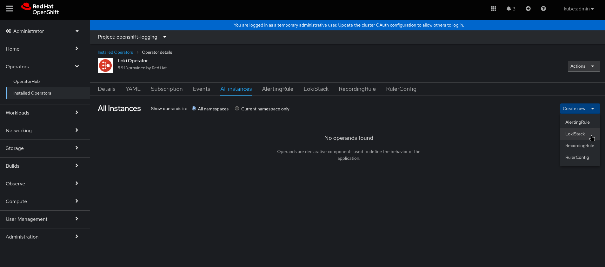

# Upgrading OCP Logging from version 5.x to version 6.x
## Prerequisites
- You should have an OCP cluster installed and
  * able to access its API URL through the `oc` client
  * able to access its Console URL through a normal web browser
  * you have access to a supported object store (AWS S3, Google Cloud Storage, Azure, Swift, Minio, OpenShift Data Foundation).
 
## Install the version 5.x OCP Logging stack
- Follow the steps in the official documentation [Installing Logging and the Loki Operator using the web console](https://docs.redhat.com/en/documentation/openshift_container_platform/4.14/html/logging/cluster-logging-deploying#logging-loki-gui-install_cluster-logging-deploying) and [Installing log storage](https://docs.redhat.com/en/documentation/openshift_container_platform/4.14/html/logging/log-storage-2#installing-log-storage) and [Loki object storage](https://docs.redhat.com/en/documentation/openshift_container_platform/4.14/html/logging/log-storage-2#logging-loki-storage_installing-log-storage)

For this demonstration we will deploy the Logging stack on an OCP cluster installed on Google Cloud Platform with Google Cloud Storage available as supported object store through the default `standard-csi` storageclass.

As further prerequisites we list the following:
- You created a project on Google Cloud Platform (GCP)
- You created a bucket in the same project.
- You created a service account in the same project for GCP authentication.

### Create an object storage bucket

Go to https://console.cloud.google.com/storage/ and create a bucket with a globally unique name, e.g. "9a4e5d52-logging-loki"


### Create an object storage secret

```
$ oc -n openshift-logging \
> create secret generic logging-loki-gcs \
> --from-literal=bucketname="9a4e5d52-logging-loki" \
> --from-file=key.json="./key.json"
secret/logging-loki-gcs created
```

### Install Loki Operator version 5.9


### Install Logging Operator version 5.9


### Switch project to openshift-logging

By navigating to the `Installed Operators` menu, one is presented with a list of operators installed in all namespaces:


Using the drop-down `Project:` menu we switch view to see only the operators in the `openshift-logging` project:


### Create LokiStack instance



We create a LokiStack instance named `logging-loki` and referencing the previously created object storage secret. Please notice that loki sizing used is `1x.demo`. For a full overview of the possible loki deployment sizing and requested resources, please refer to the official documentation [Loki deployment sizing](https://docs.redhat.com/en/documentation/openshift_container_platform/4.14/html/logging/log-storage-2#loki-deployment-sizing_installing-log-storage)


If one has not previously created the referenced secret, the instance appears in status `Degraded`:


If all the components are fully validated, the instance appears in status `Ready`:


### Create OpenShift Logging instance


